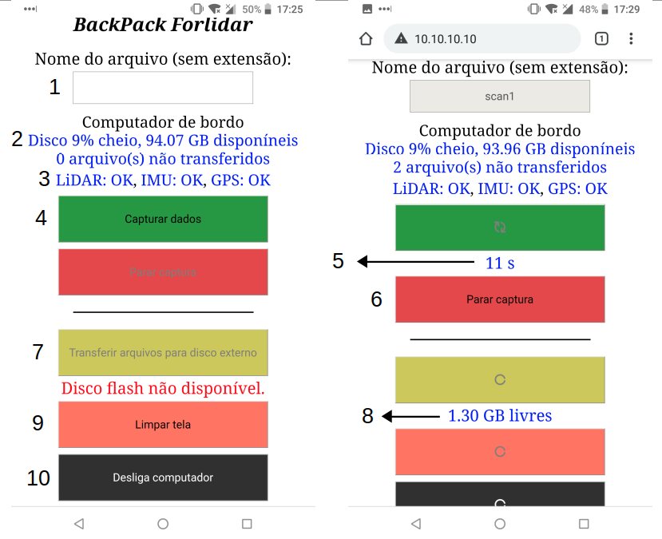

## Manual de uso *BackPack Forlidar 2.0*

#### Tiago de Conto, 31 de Janeiro de 2020

### Visão geral do sistema

A *BackPack ForLiDAR* é uma plataforma portátil para coleta de dados LiDAR em movimento, também chamado de *setup* de escaneamento laser ou MLS (*Mobile Laser Scanning*). Os principais componentes da BackPack são:

1. (externo) Sensor LiDAR Velodyne VLP-16
2. (externo) Sensor Inercial IMU/INS SBG Ellipse A
3. (interno) Micro computador Intel NUC
4. (interno) Sensor GNSS/GPS Garmin 18x LVC
5. (interno) Roteador portátil TripMate Nano
6. (interno) Bateria de lítio com 3 células, 11.1V
7. (interno) Monitor de voltagem 2.7-3.8V com aviso sonoro
8. (interno) Interface de conexão VLP-16 + Garmin 18x
9. (interno) Extensão USB 3.0

Figura 1. Visão geral da *BackPack ForLiDAR*.

### Antes de usar

Mantenha as baterias sempre fora da mochila quando não estiver usando o equipamento, devidamente acondidionadas em material isolante. Garanta que a voltagem das baterias esteja acima dos 9.6V (3.2V por célula), caso contrário o uso do equipamento é comprometido.

Uma bateria cheia garante o uso contínuo da mochila por cerca de 2 horas. Recomenda-se o transporte do equipamento *desligado*, ligando-o apenas no local a ser escaneado e desligando-o logo após o escaneamento, com os sensores externos devidamente guardados dentro dos compartimentos da mochila, a fim de evitar choques, riscos e danos por contato externo. Para escaneamentos intermitentes em locais próximos, onde o deslocamento for de poucos minutos, o equipamento pode ser transportado ainda ligado e montado.

Figura 2. Acondicionamento das baterias.

### Preparando o sistema

1. Abra a mochila, retire o LiDAR e o IMU, garantindo que o IMU esteja fixo no topo do LiDAR.
2. Encaixe a base do LiDAR na barra telescópica que sai de cima da mochila, com a fiação apontando para trás - lado oposto às alças da mochila, no mesmo sentido de abertura da tampa. Garanta que o encaixe esteja firme.
3. Conecte a bateria no cabo de força interno e acondicione a bateria no compartimento adequado.
4. Conecte o monitor de voltagem no conector de balanceamento. Garanta que o mesmo apite e uma luz vermelha pisque assim que conectado à bateria.
5. Aperte o botão no topo do monitor de voltagem até chegar em "3.20".
6. Feche a mochila, ajuste as alças, regule a altura da barra telescópica e a rotação do encaixe do sensor LiDAR para a posição desejada.

Figura 3. Etapas no preparo do equipamento.

### Utilização do equipamento

#### Ligar os componentes e acessar a interface de controle web

1. Aperte o botão circular na lateral do mochila para ligar os sensores, ativando a transmissão de corrente da bateria.
2. Espere de 10 a 20 segundos.
3. Clique no botão retangular, logo acima do botão circular, para ligar o Micro computador e ativar a transmissão dos dados dos sensores.
4. Vista a mochila e garanta que a mesma esteja presa firmemente ao operador.
5. Espere de 10 a 20 segundos até a abertura de rede WiFi **ForLiDAR**.
6. Utilize qualquer aparelho com conexão *wireless* (smartphone, tablet, laptop etc.), deslique a conexão de dados do aparelho e o conecte via WiFi à rede ForLiDAR - senha de acesso: *forlidar*
7. Abra o navegador de internet e digite *10.10.10.10* na barra de endereços para acesso ao *app* de controle da mochila.

Figura 4. Ligando a mochila.

#### Controle por aplicativo web

O aplicativo web consiste em uma tela única de controle da coleta de dados. As diferentes partes do *app* são descritas a seguir:

1. Barra de texto, por onde são nomeados os arquivos de coleta de dados.
2. Monitoramento de disco do computador de bordo - espaço disponível e quantidade de arquivos em disco.
3. Monitoramento do fincionamento dos sensores LiDAR, IMU e GPS.
4. Botão para início da coleta de dados.
5. *Timer*: duração da coleta de dados.
6. Botão para interrupção/finalização da coleta de dados.
7. Botão para transferência dos dados do disco interno para *drive* externo (HD externo, disco flash etc.).
8. Monitoramento do disco externo.
9. Botão para limpar a tela do app - equivalente ao *refresh* do browser.
10. Botão para desligar o micro computador de bordo.

Figura 5. Visão geral do aplicativo web de controle da mochila.

### Boas práticas na coleta de dados LiDAR-MLS

Sempre que for realizar um escaneamento, nomeie o arquivo e só aperte o botão de início de coleta uma vez confirmado o funcionamento do sensor LiDAR (item 3 do app). Não havendo sinal do GPS e do IMU, o escaneamento ainda pode ser realizado, mas para o não comprometimento dos resultados é importante que todos os sensores estejam ligados e transmitindo dados adequadamente.

Não esqueça de desabilitar a coneção de dados 3G/4G com a internet quando for conectar à mochila, a fim de evitar interferência no sinal do equipamento.

Após apertar o botão para início do escaneamento, acompanhe o *timer* logo abaixo do botão e só comece a caminhar após passados de 10 a 20 segundos. Esse tempo parado ajuda na estabilização do sistema e melhora a qualidade dos dados gerados do escaneamento.

Faça o trajeto de escaneamento o mais suave possível - ande devagar, evite curvas ao longo da caminhada e, principalmente, **evite tremulações, tropeços e movimentos bruscos** que afetem a estabilidade do sensor LiDAR acoplado à barra telescópica. Em caso de movimentos bruscos e quedas, recomenda-se reiniciar o escaneamento.

**SEMPRE** deslique o computador de bordo antes dos sensores e via software, através do botão preto do app (item 10). Após apertar o botão de desligar o computador, espere de 10 a 20 segundos, ou até a rede WiFi ForLiDAR desaparecer, e só então deslique os sensores desativando o **botão circular** na lateral da mochila, para desativar a bateria - os ventiladores da mochila e o LiDAR devem parar de vibrar.

Caso o monitor de voltagem apite durante um escaneamento, deslique o computador e sensores, respectivamente, logo após término do caminhamento e então faça a troca da bateria, reconectando o monitor de voltagem à bateria nova.

Faça a transferência dos dados todos uma única vez após um período de trabalho, dê preferência a periféricos com conexão USB 3.0 ou maior, para acelerar a transferência. Evite manter dados no disco do computador de bordo e sempre garanta que o espaço interno disponível na mochila é suficiente para armazenar dados de um dia inteiro de trabalho.